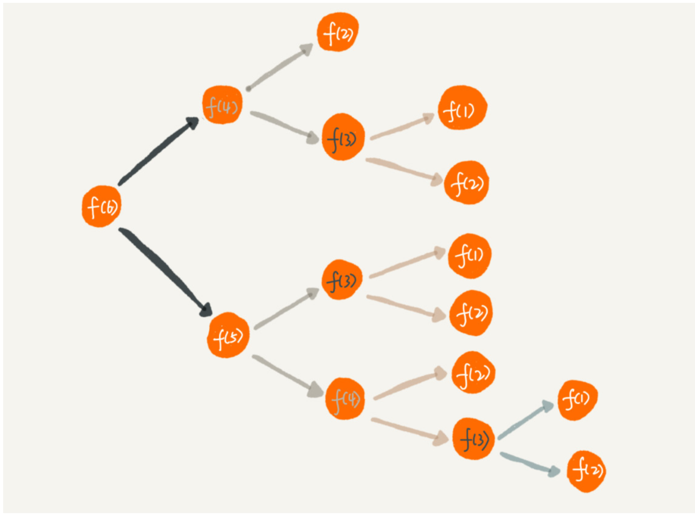

# 递归


## 理解递归
抽象出层次逻辑，找出规律，用简单的代码实现逻辑

## 递归的条件
1. 一个问题的解可以分为几个子问题的解  
2. 这个问题与分解后的子问题求解方式基本相同
3. 存在递归终止条件


## 编写递归代码
- 写出递归公式，找到终止条件

## 堆栈溢出
- 递归过程
	- 每递归深一层，就会将上层的堆栈信息保存到内存中，简称为`递`的过程
	- 下层计算完，往上层返回，简称为`归`的过程
	- 递的过程是个压栈的过程，使用栈来保存临时变量
	- 归的过程是个出栈的过程
- 若递归调用层次很深，内存中压栈数据较多，就有堆栈溢出风险
- 解决方案：
	- 增加变量记录深度，当深度大于设定阈值，则抛异常

## ※避免重复计算※
- 递归重复案例：

	- 上图案例中f(6)会用到f(5)和f(4)结果，f(5)也会用到f(4)结果，如果传统的递归程序，会计算两次f(4)的结果
	- 嵌套层次较深时，严重影响效率，可以使用一种数据结构（比如：`散列表`）来保存已经求解过的f(n),来防止重复计算导致的影响效率的问题

- 代码实现

```
public int f(int n) {
  if (n == 1) return 1;
  if (n == 2) return 2;
// hasSolvedList Map key n value f(n) if (hasSolvedList.containsKey(n)) {
    return hasSovledList.get(n);
  }
  int ret = f(n-1) + f(n-2);
  hasSovledList.put(n, ret);
  return ret;
}
```

## 递归代码编写为非递归代码

- 非递归代码的优势
	- 内存中保留的数据较少，不会发生上述的堆栈溢出问题
- 分析递归的过程可知，`递`实际上就是简化逻辑，让上层依赖下层的结果，`归`实际上就是计算了下层的结果，传递给上层，直到最上层就是我们所要的计算结果
- 如果我们直接按照归的过程来实现代码逻辑，那么就可以把递归代码编写为非递归代码

- 递归`f(x) = f(x-1) + 1`可改写为以下代码

```
int f(int n) {
  int ret = 1;
  for (int i = 2; i <= n; ++i) {
		ret = ret + 1; 
  }
  return ret; 
}
```


## 递归调试
- IDE设置断点单步调试时，当嵌套层很深时，如果调试？
	- 打印日志，发现递归值
	- 结合条件断点进行调试


