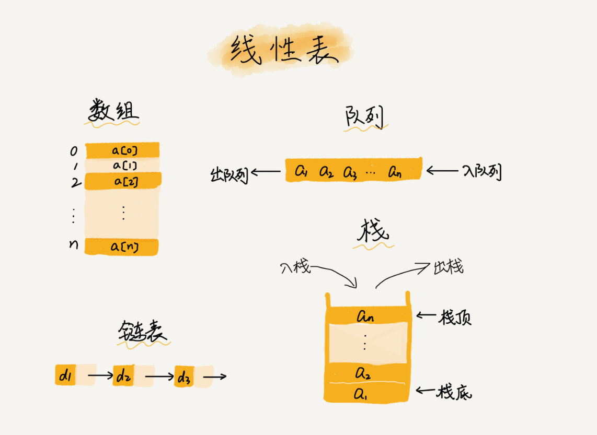

# 基本数据结构

## 目录

### [1.数组](./1.数组)

### [2.链表](./2.链表)

### [3.栈](./3.栈)

### [4.队列](./4.队列)

## 简介

- 每个线性表上的数据最多只有前和后两个方向。其实除了数组，链表、队列、栈等也是线性表结构

- 非线性表，比如二叉树、堆、图等。之所以叫非线性，是因为，在非线性表中，数据之间并不是简单的前后关系

