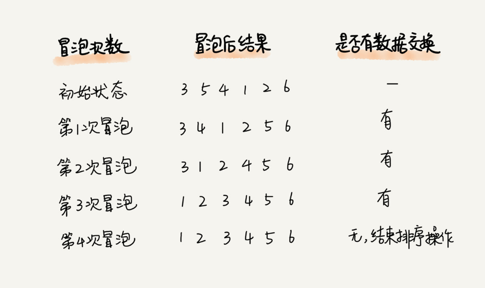

# 冒泡排序

## 介绍

- 冒泡排序只会操作相邻的两个数据。每次冒泡操作都会对相邻的两个元素进行比较，看是否满足大小关系要求。如果不满足就让它俩互换。中途遇到一个最大值，那么最大值肯定会被一直交换，直到交换到最后一个元素。一次冒泡会让至少一个元素移动到它应该在的位置，重复 n 次，就完成了 n 个数据的排序工作。

- 每次排序类似于 n个无序数中找最大值一样，需要把n个数遍历一遍

    - 冒泡排序是将未排序序列的最大值一直往后交换，所以每次排序都会找到最大值，并将最大值放置到合理的位置

- 对一组数据 4，5，6，3，2，1，从小到到大进行排序。第一次冒泡操作的详细过程就是这样：

    

    - 可以看出，经过一次冒泡操作之后，6 这个元素已经存储在正确的位置上。要想完成所有数据的排序，我们只要进行 6 次这样的冒泡操作就行了
    
    - 每次冒泡后的结果
    
        

- 冒泡排序的优化

    - 当某次冒泡操作已经没有数据交换时，说明已经达到完全有序，不用再继续执行后续的冒泡操作
    
        - 比如： 1、2、3、4、5、6。没有数据交换，说明第一个比第二个小，第二个比第三个小，第三个比第四个小，依次类推，说明全局有序了，已经排序完成
        
        
 
- 排序分析

    - 空间复杂度
        
        - 只涉及相邻数据的交换操作，只需要常量级的临时空间，所以它的空间复杂度为 O(1)

    - 时间复杂度
    
        - 第一轮交换，需要遍历n个数，第二轮交换，最大的数已经排序完成，只需要遍历 (n-1) 个数，依次类推，时间复杂度为 n+(n-1)+(n-2)+1 = n2/2

        - 时间复杂度为 O(n2)
        
        - 如果数据本来就是有序的，最好时间复杂度O(n)

- 稳定的排序算法
    
    - 只涉及到相邻元素的交换，当元素相同时，不交换，所以冒泡排序是稳定的排序算法

[代码实现](../../../src/main/java/fanrui/study/sort/BubbleSort.java)

### [*back*](../)

### [*next*](../2.插入排序)

