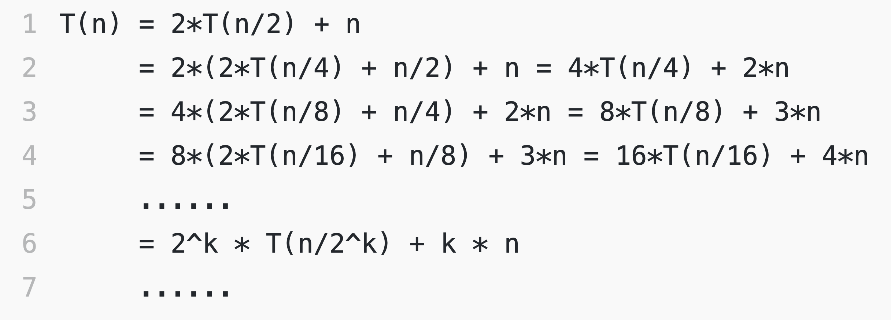

# 归并排序

## 介绍

- 归并排序的核心思想还是蛮简单的。如果要排序一个数组，我们先把数组从中间分成前后两部分，然后对前后两部分分别排序，再将排好序的两部分合并在一起，这样整个数组就都有序了。

- 归并排序使用的就是分治思想。分治，顾名思义，就是分而治之，将一个大问题分解成小的子问题来解决。小的子问题解决了，大问题也就解决了。递归下去，当数组长度为1时，就可以把长度为n的一个数组，当做n个内部有序的长度为1的数组

	

- 将两个有序数组合并为一个有序数组的过程叫做merge，实现原理如下

	- 两个数组是有序的，所以其最小值肯定在队首，每次拿出两个数组未排序部分的最小值即可

	

## 排序分析

- 时间复杂度分析方法一
	
	- T(1) = C；n=1 时，只需要常量级的执行时间，所以表示为 C。

	- T(n) = 2 * T(n/2) + n； n>1 

	

	- 通过这样一步一步分解推导，我们可以得到 T(n) = 2k * T(n/2k)+k * n。当 T(n/2k)=T(1) 时，也就是 n/2k=1，我们得到 k=log2n 。我们将 k 值代入上面的公式，得到 T(n)=Cn+nlog2n 。如果我们用大 O 标记法来表示的话，T(n) 就等于 O(nlogn)。所以归并排序的时间复杂度是 O(nlogn)。

	- 归并排序的执行效率与要排序的原始数组的有序程度无关，所以其时间复杂度是非常稳定的，不管是最好情况、最坏情况，还是平均情况，时间复杂度都是 O(nlogn)。

- 时间复杂度分析方法二（野鸡法）
	
	- 研究原理发现时间主要耗在了合并有序集合
	
	- 两个集合变成一个集合用了O（n），四个变两个用了O(n)，八个变四个也是O(n)。所以递归的每层时间复杂度都是O(n)，现在我们知道归并排序的递归深度是 logn，所以整个时间复杂度就是O(n log n)

- 空间复杂度

	- 空间复杂度是 O(n)，需要一个O(n)大小的数组来合并数据

- 稳定的排序算法
	
	- 没有跳着交换的情况，所以归并排序是稳定的排序算法

## 归并排序的优化

- 检测整个序列中已经排序好的子序列

	- 要排序的序列经常是部分有序的序列

		- [1,5,7] [2,6,8,10,12] [4,3,9,11,13,15,16,14]

	- 递归层数明显减少
	
- TimSort排序中对归并排序的优化（Galloping Mode - 飞奔模式）

	- 例：1、2、3、7、8与5、6、9、10合并时，其实只有7、8、5、6需要移动，其余的1、2、3、9、10位置不用变动

	- 找到第二个数列中最小的数在第一个数列中的位置i，那么i之前的数据都不需要挪动

	- 找到第一个数列中最大的数在第二个数列中的位置j，那么j之后的数据都不需要挪动

## 代码实现

[归并排序代码实现](../../../src/main/java/fanrui/study/sort/MergeSort.java)

### [*back*](../)

### [*last*](../3.选择排序)

### [*next*](../5.快速排序)
