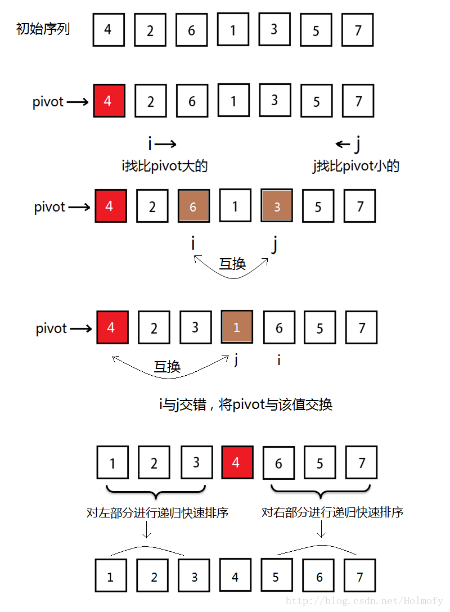
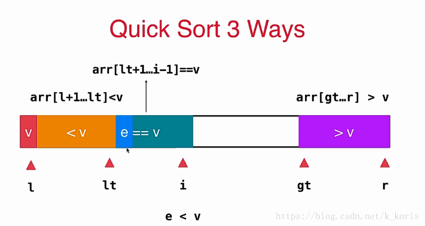
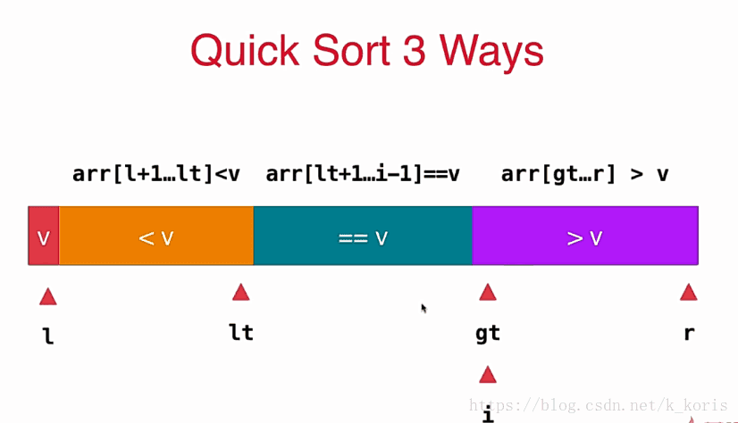
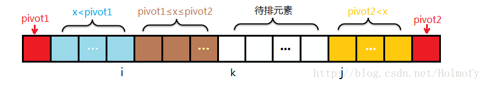
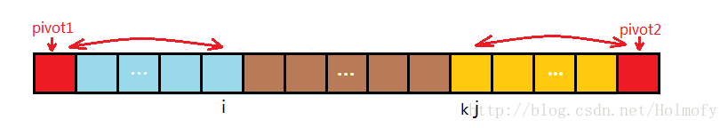
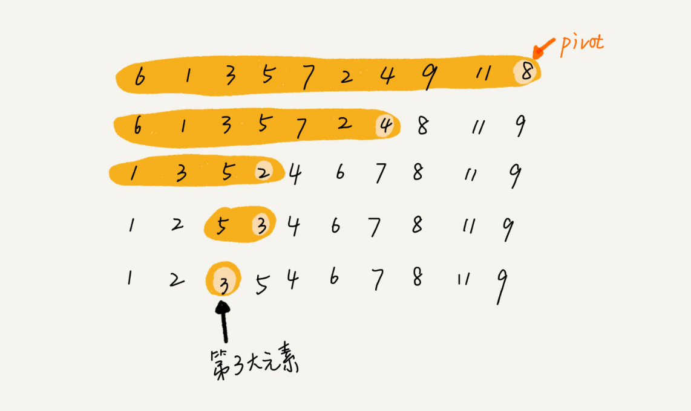

# 快速排序

## 介绍

- 如果要排序数组中下标从 p 到 r 之间的一组数据，我们选择 p 到 r 之间的任意一个数据作为 pivot（分区点）。

- 我们遍历 p 到 r 之间的数据，将小于 pivot 的放到左边，将大于 pivot 的放到右边，将 pivot 放到中间。经过这一步骤之后，数组 p 到 r 之间的数据就被分成了三个部分，前面 p 到 q-1 之间都是小于 pivot 的，中间是 pivot，后面的 q+1 到 r 之间是大于 pivot 的。

	- 快排一次分区后的图示：
	
	
	
	- 一次快排的过程示意图：

	

- 根据分治、递归的处理思想，我们可以用递归排序下标从 p 到 q-1 之间的数据和下标从 q+1 到 r 之间的数据，直到区间缩小为 1，就说明所有的数据都有序了

## 性能分析

 - 空间复杂度

	- O(1)

- 时间复杂度

	- 每次分区操作，都能正好把数组分成大小接近相等的两个小区间，那快排的时间复杂度递推求解公式跟归并是相同的。所以，快排的时间复杂度也是 O(nlogn)。

	- 但是，公式成立的前提是每次分区操作，我们选择的 pivot 都很合适，正好能将大区间对等地一分为二。但实际上这种情况是很难实现的。举一个比较极端的例子。如果数组中的数据原来已经是有序的了，比如 1，2，3，4，5，6。如果我们每次选择最后一个元素作为pivot，那每次分区得到的两个区间都是不均等的。我们需要进行大约 n 次分区操作，才能完成快排的整个过程。每次分区我们平均要扫描大约 n/2 个元素，这种情况下，快排的时间复杂度就从 O(nlogn) 退化成了 O(n2)。

- 不稳定的排序算法

	- 9、9、9、1、2、3、4、5、6，若选取6为pivot点，按照上面介绍的快排步骤，三个9的先后顺序发生了变换

## 优化

- 解决分区不均导致性能退化成O(n2)的问题，通过以下方案使得分区点更均匀一些

	- 三数取中法
	
	- 数据量很大时，可以五数取中

	- 数组中随机取数法，不是每次从头或者尾

- 当要排序的**数据重复性较高**时，可以使用3-way快排（DualPivotQuicksort中用到）

	- 快速排序面对重复的元素时的处理方法是，把它放在了左部分数组或右部分数组，下次进行分区时，还需检测它。如果需要排序的数组含有大量重复元素，则这个问题会造成性能浪费
	
	- 解决方法：新增一个相同区域，并把重复元素放进去，一轮分区操作，直接将所有=v的数据都找到其对应的位置，下次进行分区时，=v的所有数据已经不需要再参与排序

	- 3-way快排过程图

		

		- 普通的快排只有小于v和大于等于v的两个区间，3-way快排包含小于v、大于v、等于v的三个区间，解决了对大量=v的元素重复排序的过程
		
	- 3-way快排结果图

		

- 双轴快排（DualPivotQuicksort中用到）
	
	- 每次选取两个分区点，pivot1、pivot2，其中 pivot1 < pivot2

	- 双轴快排过程图

		

		- 数据被两个分区点分成三段
		
		- 第一段数据全小于pivot1，第二段 pivot1 <= && <= pivot2 ，第三段 > pivot2
		
	- 双轴快排结果图

		

	- 双轴快排相比普通快排优化在哪里？

		- 将数据分成三个区，每个区递归时，区间内的元素个数减少，所以减少了递归的深度

## 快排的其他应用场景

- n个数据查找第K大元素或者第K小元素（n是很大的数量级，比如亿或者千万级别）

	- 我们选择数组区间 A[0…n-1] 的最后一个元素 A[n-1] 作为 pivot，对数组 A[0…n-1] 原地分区，这样数组就分成了三部分，A[0…p-1]、A[p]、A[p+1…n-1]。如果 p+1=K，那 A[p] 就是要求解的元素；如果 K>p+1, 说明第 K 大元素出现在 A[p+1…n-1] 区间，我们再按照上面的思路递归地在 A[p+1…n-1] 这个区间内查找。同理，如果 K<p+1，那我们就在 A[0…p-1] 区间查找。

		

	- 为什么上述解决思路的时间复杂度是 O(n)？
	
		- 假设每次分区比较均匀，每遍历一次，平均扔掉一半的数据

		- 第一次分区查找，我们需要对大小为 n 的数组执行分区操作，需要遍历 n 个元素。第二次分区查找，我们只需要对大小为 n/2 的数组执行分区操作，需要遍历 n/2 个元素。依次类推，分区遍历元素的个数分别为、n/2、n/4、n/8、n/16.……直到区间缩小为 1。如果我们把每次分区遍历的元素个数加起来，就是：n+n/2+n/4+n/8+…+1。这是一个等比数列求和，最后的和等于 2n-1。所以，上述解决思路的时间复杂度就为 O(n)

- n个数据中找TopK的所有元素

	- 利用上述 找第K大元素的思想，那么K之前的元素都是比K大的元素，直接取出即可

## 快排与归并排序对比

- 归并排序的处理过程是由下到上的，先处理子问题，然后再合并。而快排正好相反，它的处理过程是由上到下的，先分区，然后再处理子问题。

- 归并排序虽然是稳定的、时间复杂度为 O(nlogn) 的排序算法，但是它是非原地排序算法。归并之所以是非原地排序算法，主要原因是合并函数无法在原地执行。快速排序通过设计巧妙的原地分区函数，可以实现原地排序，解决了归并排序占用太多内存的问题。

	

## 代码实现

[普通快排代码实现](../../../src/main/java/fanrui/study/sort/QuickSort.java)

[3-way快排代码实现](../../../src/main/java/fanrui/study/sort/Quick3WaySort.java)

- 3-way快排和双轴快排可以参考java的DualPivotQuicksort实现

### [*back*](../)

### [*last*](../1.冒泡排序)

### [*next*](../3.选择排序)
