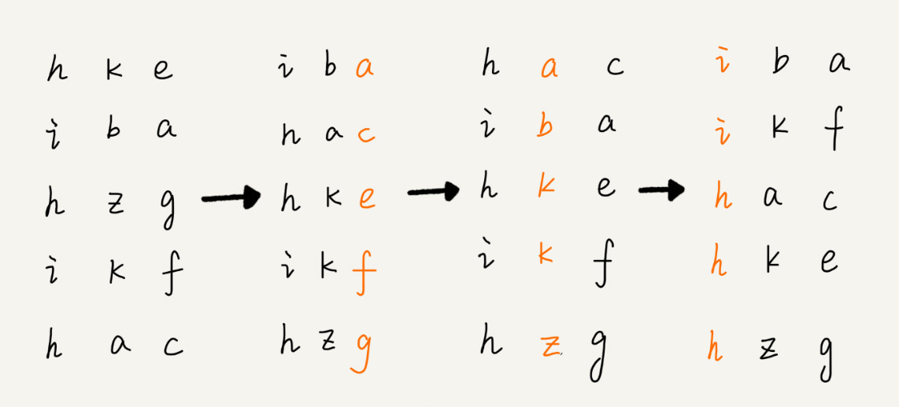

# 基数排序

## 介绍

- 假设要比较两个手机号码 a，b 的大小，如果在前面几位中，a 手机号码已经比 b 手机号码大了，那后面的几位就不用看了。

- 借助稳定排序算法，先按照最后一位来排序手机号码，然后，再按照倒数第二位重新排序，以此类推，最后按照第一位重新排序。经过 11 次排序之后，手机号码就都有序了

- 手机号码稍微有点长，画图比较不容易看清楚，用字符串排序的例子，画了一张基数排序的过程分解图

	

	- 图中最后排序好的数据，有三个h开头的数据，他们的第二位按升序排列了，因为咋们按照低位开始往前排序，且使用了稳定的排序算法

## 约束

- 按照每位来排序的排序算法要是稳定的，否则这个实现思路就是不正确的。因为如果是非稳定排序算法，那最后一次排序只会考虑最高位的大小顺序，完全不管其他位的大小关系，那么低位的排序就完全没有意义了

- 基数排序对要排序的数据是有要求的，需要可以分割出独立的“位”来比较，而且位之间有递进的关系，如果 a 数据的高位比 b 数据大，那剩下的低位就不用比较了。除此之外，每一位的数据范围不能太大，要可以用线性排序算法来排序，否则，基数排序的时间复杂度就无法做到 O(n) 了。

- 应用场景：11位的手机号排序、单词排序，我们可以把所有的单词补齐到相同长度，位数不够的可以在后面补“0”

### [*back*](../)

### [*last*](../8.计数排序)

### [*next*](../10.各排序性能对比)
