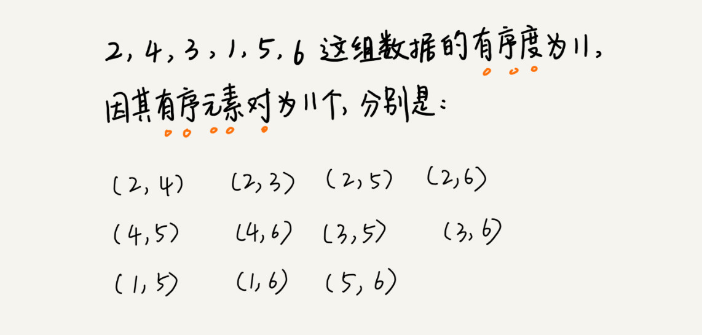

# 常用排序算法

## 目录

### [1.冒泡排序](./1.冒泡排序)

### [2.插入排序](./2.插入排序)

### [3.选择排序](./3.选择排序)

### [4.归并排序](./4.归并排序)

### [5.快速排序](./5.快速排序)

### [6.堆排序](./6.堆排序)

### [7.桶排序](./7.桶排序)

### [8.计数排序](./8.计数排序)

### [9.基数排序](./9.基数排序)

### [10.各排序性能对比](./10.各排序性能对比)

### [11.剖析工业级排序的实现原理](./11.剖析工业级排序的实现原理)

## 排序基本概念

- 时间复杂度

- 空间复杂度

- 稳定性

    - 如果待排序的序列中存在值相等的元素，经过排序之后，**相等元素之间原有的先后顺序不变**
    
    - 比如我们有一组数据 2，9，3，4，8，3，按照大小排序之后就是 2，3，3，4，8，9。这组数据里有两个 3。经过某种排序算法排序之后，如果两个 3 的前后顺序没有改变，那我们就把这种排序算法叫作稳定的排序算法；如果前后顺序发生变化，那对应的排序算法就叫作不稳定的排序算法。
    
    - 一般给对象排序时，都使用稳定的排序算法

- 有序度

    - 有序度是数组中**具有有序关系的元素对**的个数
    
    - 对于一个倒序排列的数组，比如 6，5，4，3，2，1，有序度是 0；对于一个完全有序的数组，比如 1，2，3，4，5，6，有序度就是**n*(n-1)/2**，也就是 15。我们把这种完全有序的数组的有序度叫作满有序度。
    
    

- 逆序度

    - 逆序度的定义正好跟有序度相反（默认从小到大为有序）

    - 逆序度 = 满有序度 - 有序度

    - 比如 1，2，3，4，6，5，逆序元素对只有（6，5），所以逆序度就是1

- 原地排序
    
    - 原地排序算法，就是特指空间复杂度是 O(1) 的排序算法

## 各排序算法从以下角度进行介绍、比较分析

- 各排序算法的实现原理、时间空间复杂度、优化

- 各排序算法进行性能对比（结合程序案列）

- 工业级别的排序实现

[各算法原理动态演示](https://www.cs.usfca.edu/~galles/visualization/Algorithms.html)

