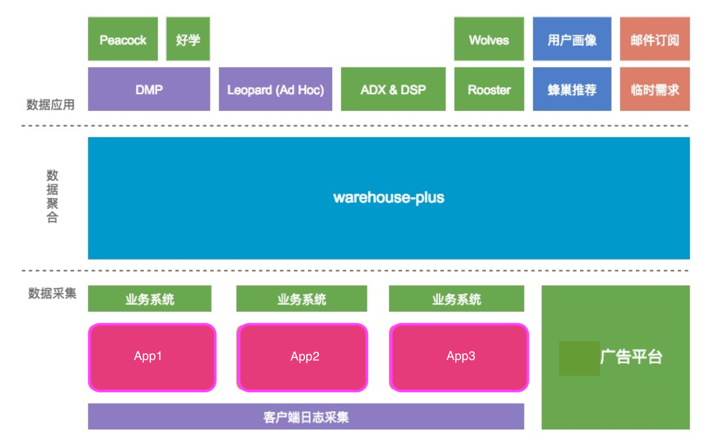

# 分布式数据仓库在公司的应用与演变

本文只关注与分布式数据仓库在公司的使用和演变，不涉及任何技术细节。希望通过本文的总结，能让你对数据仓库在公司的应用与演变，以及相关技术栈有初步的认识。

## 数据仓库生态



如图为公司内部数据仓库生态，主要包括了三部分：数据采集，数据聚合和数据应用


### 数据采集

- 客户端用户行为日志采集，通过采集和分析用户行为日志，可以帮助运营团队合理化运营，商务团队智能化广告投放，数据挖掘团队精准化文章推荐，产品团队动态化把握版本迭代。
- 业务系统数据同步，主要同步有统计需求的业务数据和相关维度数据。业务数据，如金币流水，可定时将金币流水数据同步到数据仓库中，减轻每日频繁的统计对业务系统的影响，减少业务开发团队对数据统计需求的工作量。维度数据，如peacock投放的文章，广告等详情数据，同步这些数据是为了在基于条目统计时可更好的分析各维度下的文章或广告投放。
- 广告平台日志采集，为了更好的分析广告平台中广告投放ctr，广告请求响应效率，以及广告素材质量等。数据仓库主要采集了广告曝光、点击数据，请求第三方的广告素材数据，以及广告请求响应状态码、响应时间等数据。

### 数据聚合
数据聚合中，通过维度建模、数据分层、统计任务的定时调度，将客户端、业务系统、广告平台采集的数据进行规范化的聚合、统计。最终，生成面向各主题需求的统计结果，供数据应用层使用。

这里不在阐述维度建模、数据分层相关技术，可参考之前的文章。

### 数据应用

在数据应用层中，主要列举了公司内部正在依托于数据仓库而运行的各系统，下面简单介绍各系统的职能。

- DMP：数据报表平台。统计展示最频繁的统计需求结果，同时为其他平台提供数据接口
- Peacock & 好学：内容、广告投放系统。需借助DMP展示各投放内容的实时曝光、点击等统计
- Leopard：正在研发的即席查询平台。将逐渐替代DMP，可在该平台即席查询任意组合条件的统计数据
- ADX & DSP：广告交易平台，借助数据仓库统计广告曝光、点击，请求响应等数据
- Wolves：市场渠道质量评估平台，基于真实的用户行为数据，动态评估第三方推广渠道所带来的用户质量
- Rooster：智能推送系统。借助数据仓库完成自定义的统计需求（即面向各维度的用户群进行推送），统计推送下发、到达和曝光结果。
- 用户画像 & 蜂巢推荐：借助数据仓库可为各app用户建立自己的用户画像，并基于用户画像为用户提供个性化的内容推荐。
- 临时需求：当在各数据平台中无法查询的统计需求，可临时提交给数据仓库工程师，由其构建特殊的查询SQL，来获取统计结果。
- 邮件订阅：对于一些常规的，只是阶段性的需求，可以邮件订阅的方式来获取统计数据。

## 数据仓库技术架构-v1.0


下面列举V1.0使用的数据仓库技术栈：

- Flume：分布式、可靠、高可用的海量日志收集的系统。支持各种各样的数据源（HTTP、log等Source），能将这些数据源的数据高效的收集，聚合、移动，最后存储到指定存储系统（Kafka or HDFS）中。图中是使用Flume去收集各日志采集服务器中用户行为日志数据。
- Kafka：分布式的、基于发布/订阅的消息系统。可以将Flume收集到日志，按照不同的主题按序存储到不同的Topic队列中，然后多个Consumer可以同时去消费Topic中的数据。
- Storm：分布式实时大数据处理系统。用以实时的消费Kafka中的数据，并做相关计算处理。可直接将数据存储到HDFS中，也可基于某些统计逻辑，将统计后到数据存储到HBase中。
- HDFS：分布式文件系统，能提供高吞吐量的数据访问。
- Hive：基于HDFS的一个数据仓库工具，可以将结构化的数据文件映射为数据库表，并提供简单的sql查询功能，可以将sql语句转换为MapReduce任务进行运行。适合用来对一段时间内的数据进行分析查询。
- HBase：分布式的、面向列的开源数据库，是一种Key/Value系统，其数据文件都存储在HDFS中，非常适合用来进行大数据的实时查询。
- Phoenix：本质是用Java写的基于JDBC API操作HBase的开源SQL引擎。
- Yarn：一个通用资源管理系统，可为上层应用提供统一的资源管理和调度。
- Sqoop：用在Hive与传统关系型数据库间的数据传递，可以将一个关系型数据库中的数据导进到Hive中，也可以将Hive表中的数据导进到关系型数据库中。
- Redis & Mysql：与业务紧密相联的存储。可将Hive or HBase中统计的数据同步到这些业务库中。


## 数据仓库技术架构-v2.0


下面列举V2.0新增的数据仓库技术栈：

- Logstash：一款强大的数据处理工具，可以实现数据传输，格式处理，格式化输出，还有强大的插件功能，常用于日志处理。它结合Elasticsearch和kibana可实现一套完整的日志分析系统，其中，ES进行存储、建立搜索索引，kibana调用ES接口进行数据可视化。
- Spark：拥有DAG执行引擎，支持在内存中对数据进行迭代计算，适合大数据分析统计，实时数据处理，图计算及机器学习。
- Spark-Streaming：将持续不断输入的数据流转换成多个batch分片，使用一批spark应用实例进行处理。
- Hive on Spark：目的是把Spark作为Hive的一个计算引擎，将Hive的查询作为Spark的任务提交到Spark集群上进行计算。与SparkSQL结构类似，只是SQL引擎不同，但是计算引擎都是spark
- Kudu：新一代面向实时分析的存储引擎，底层使用类似Parquet的存储结构，支持实时写入，实时更新，实时查询。扫描性能比Parquet略差。
- Impala：全新的执行引擎（真正的MPP查询引擎），在执行SQL语句的时候，Impala不会把中间数据写入到磁盘，而是在内存中完成了所有的处理。使用Impala的时候，查询任务会马上执行而不是生产Mapreduce任务，这会节约大量的初始化时间。
- DataX：阿里开源的，一个异构数据源离线同步工具，致力于实现包括关系型数据库(MySQL、Oracle等)、HDFS、Hive、ODPS、HBase、FTP等各种异构数据源之间稳定高效的数据同步功能。
- ES & MongoDB：借助Hive的StorageHandler插件，可将hive的数据通过外部表的形式关联到ES or MongoDB中，可以实现双向读写。


## 即席查询系统
即席查询是用户根据自己的需求，灵活的选择查询条件，系统能够根据用户的选择生成相应的统计报表。即席查询与普通应用查询最大的不同是普通的应用查询是定制开发的，而即席查询是由用户自定义查询条件的。

### 即席查询技术架构
基于数据仓库中事实表的设计，我们的Ad-Hoc简单的架构如下图：


架构比较简单，主要借助Impala + parquet去查询HDFS中的数据，并借助kudu接收实时写入的数据，

在T+1日后，会将kudu中实时写入的数据转存到HDFS中，并转换成parquet格式。

Parquet存储格式

- 按列存储
- 可按时间分区
- 局部排序
- 适配多种计算框架
- 只支持批量写入，无法追加，无法实时写入

kudu 新一代面向实时分析的存储引擎

- 底层使用类似Parquet的存储结构
- 支持实时写入，实时更新，实时查询
- 扫描性能比Parquet略差

### 即席查询中动态视图的使用

下面介绍动态视图的使用，结合上面说的，我们有时候即需要查询hive中T-1的历史数据，又要查询今天实时写入的数据，怎么实现？

Impala就可以帮助我们，即可以查询Hive又可以查询Kudu，但是每次我们都需要判断日期是不是今天，来判断要不要查kudu中的数据，因此就想到了视图，并结合Union all来实现。ok，到这这里就下面的视图创建语句。

```
create view prod.ods_view_pv_event_1d as
select xxx
      ,xxx
  from prod.ods_hive_pv_event_1d
 where ds <= '20180704'
 union all
select xxx
      ,xxx
  from prod.ods_kudu_pv_event_1d
 where nginx_date = '20180705'
;
```

虽然视图创建成功，也满足了对于20180705的需求，但是如果过了这一天，20180706应该怎么查呢，还需要再创建一个视图？

其实，我们可以如下这么做，下面的语句只是将上面写死的日期改成了可根据now()动态生成的日期。这样我们就不需要每次使用的时候创建一个视图了。

视图并不是数据库中以存储的数据值集形式存在，而仅仅是存储在数据库中具有关联名称的查询语句！！

```
create view prod.ods_view_pv_event_1d as
select xxx
      ,xxx
  from prod.ods_hive_pv_event_1d
 where ds <= from_timestamp(date_sub(now(), 1),'yyyyMMdd')
 union all
select xxx
      ,xxx
  from prod.ods_kudu_pv_event_1d
 where nginx_date = from_timestamp(now(),'yyyyMMdd')
;
```

结束语：

以上总结了分布式数据仓库在公司的应用与演变，以及相关技术栈，最后简单介绍了我们正在努力研发的即席查询系统，以及即席查询系统中动态视图的妙用。


